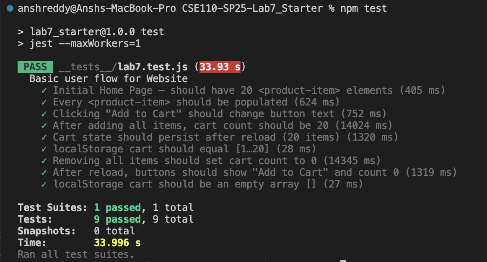
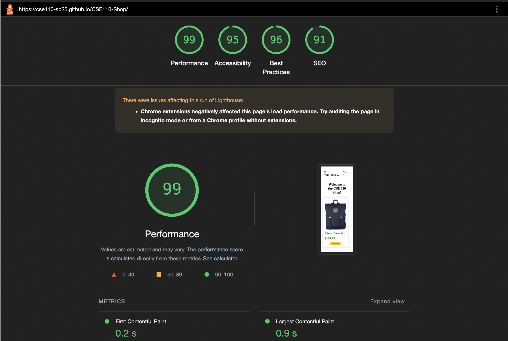

## Lab 7 – Automated E2E Testing with Jest + Puppeteer

**Name:** Sree Ansh Reddy Kalakoti (SOLO)

### Check-Your-Understanding

1. **Where would you fit automated tests in your Recipe-app pipeline, and why?**  
    I run them in a GitHub Action on every push so broken code is caught before merging into `main`.

2. **Would you use an end-to-end test to check if a plain function returns the correct output?**  
   No. A unit test is faster and isolates the function; E2E adds browser overhead.

3. **Difference between Lighthouse *navigation* and *snapshot* mode**  
   Navigation reloads the page and measures full load performance; Snapshot freezes the current DOM state and audits static issues like accessibility.

4. **Three improvements suggested by Lighthouse for the CSE 110 shop site**  
   - Compress/convert images to WebP.  
   - Eliminate unused JavaScript and CSS.  
   - Add `aria-label`s to icon buttons for better accessibility.

### Screenshots

| Jest test run | Lighthouse report |
|---------------|-------------------|
|  |  |

